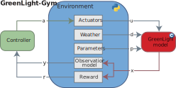

# GL-Gym

**Gymnasium environment for reinforcement learning control of greenhouse tomato crop production using the GreenLight model.**

<p align="center">
  
</p>


## Table of Contents

- [Summary](#summary)
- [Installation](#installation)
- [Quick Start](#quick-start)
- [Public Environment: GreenLightTomato-v0](#public-environment-greenlighttomato-v0)
- [Observation Space](#observation-space)
- [Action Space](#action-space)
- [Reward Function](#reward-function)
- [Parameter Sampling](#parameter-sampling)
- [Weather](#weather)
- [Evaluation Reproducibility](#evaluation-reproducibility)
- [Training and Evaluating RL Agents](#training-and-evaluating-RL-agents)
- [Rule-Based Baseline Controller](#rule-based-baseline-controller)
- [Development and Extensibility](#development-and-extensibility)
- [Citation](#citation)

---

## Summary

GL-Gym provides a [Gymnasium](https://gymnasium.farama.org/)-compatible environment that simulates a high-tech greenhouse growing tomatoes.  
An RL agent controls heating, CO2 dosing, ventilation, thermal and blackout screens, and supplemental lighting to maximise crop profit while respecting indoor climate constraints.

The underlying crop-climate model is the validated [GreenLight](https://github.com/davkat1/GreenLight) greenhouse model, implemented in [CasADi](https://web.casadi.org/) for fast numerical integration.


| Public envid                 | Task                                                                                              |
| ---------------------------- | ------------------------------------------------------------------------------------------------- |
| `gl_gym/GreenLightTomato-v0` | 60-day greenhouse tomato production control with profit-based reward and indoor climate penalties |


This repository was used in the following accepted AgriControl 2025 conference paper:

📄 Conference Paper: [GreenLight-Gym: Reinforcement learning benchmark environment for control of greenhouse production systems](https://doi.org/10.1016/j.ifacol.2025.11.827)

✏ Author: Bart van Laatum

📧 E-mail: [bart.vanlaatum@wur.nl](mailto:bart.vanlaatum@wur.nl)

---


## Installation

### Requirements

- Python >= 3.11
- Recommended: `conda` or `venv` for environment management.

### Install from PyPI

```bash
pip install gl-gym
```

### Install from source

Install from the repo, if you want basic usage demos, training and evaluation scripts, as well as access to the a standardized Python script for fetching new weather data.

```bash
git clone https://github.com/BartvLaatum/GreenLight-Gym2.git
cd GreenLight-Gym2
pip install -e .
```

### Install with training dependencies

To also install [Stable-Baselines3](https://stable-baselines3.readthedocs.io/), PyTorch, W&B, and other training utilities:

```bash
pip install "gl-gym[train]"
```

---

## Quick Start

### Create the environment

```python
import gymnasium as gym
import gl_gym  # registers gl_gym/GreenLightTomato-v0

env = gym.make("gl_gym/GreenLightTomato-v0")
obs, info = env.reset(seed=42)
```

### Run a random-action loop

```python
import gymnasium as gym
import gl_gym

env = gym.make("gl_gym/GreenLightTomato-v0")
obs, info = env.reset(seed=0)

for _ in range(100):
    action = env.action_space.sample()
    obs, reward, terminated, truncated, info = env.step(action)
    if terminated or truncated:
        obs, info = env.reset()

env.close()
```

### Flatten Dict observations for RL libraries

The raw observation space is a `gymnasium.spaces.Dict`. Most RL libraries (Stable-Baselines3, CleanRL, etc.) expect a flat `Box` space.
Wrap the environment with `FlattenObservation`:

```python
import gymnasium as gym
from gymnasium.wrappers import FlattenObservation
import gl_gym

env = gym.make("gl_gym/GreenLightTomato-v0")
env = FlattenObservation(env)

obs, info = env.reset(seed=0)
print(obs.shape)  # flat numpy array
```

### Train with Stable-Baselines3

```python
import gymnasium as gym
from gymnasium.wrappers import FlattenObservation
from stable_baselines3 import PPO
import gl_gym

env = gym.make("gl_gym/GreenLightTomato-v0")
env = FlattenObservation(env)

model = PPO("MlpPolicy", env, verbose=1)
model.learn(total_timesteps=50_000)
```

---

## Public Environment: GreenLightTomato-v0


| Property              | Value                                                                                      |
| --------------------- | ------------------------------------------------------------------------------------------ |
| **envid**             | `gl_gym/GreenLightTomato-v0`                                                               |
| **Season length**     | 60 days                                                                                    |
| **Solver timestep**   | 900 s (15 min)                                                                             |
| **Steps per episode** | 5760                                                                                       |
| **Reward**            | Profit-based: fruit revenue minus operating costs, with indoor climate violation penalties |
| **Observation space** | `Dict` with 5 modules (22 values total)                                                    |
| **Action space**      | `Box(-1, 1, shape=(6,))` (normalized)                                                      |
| **Default weather**   | Amsterdam, year 2010, start day 59                                                         |


The default registration parameters match the configuration in `gl_gym/configs/envs/GreenLightEnv.yml`.
Any keyword argument accepted by `GreenLightEnv` can be overridden in `gymnasium.make()`:

```python
env = gym.make(
    "gl_gym/GreenLightTomato-v0",
    season_length=90,
    weather_scenario_sampler="random",
    weather_scenario_sampler_kwargs={
        "locations": ["Amsterdam", "London"],
        "growth_years": [2015, 2016, 2017],
        "start_days": range(1, 120),
    },
)
```

---

## Observation Space

The observation space is a `gymnasium.spaces.Dict` assembled from independent **observation modules**.
Each module defines a named sub-space and computes its slice of the observation.

### Default modules


| Module                      | Key                         | Shape | Description                                                     |
| --------------------------- | --------------------------- | ----- | --------------------------------------------------------------- |
| `BasicCropObservations`     | `BasicCropObservations`     | (3,)  | 24h canopy temperature, fruit dry weight, temperature sum       |
| `ControlObservations`       | `ControlObservations`       | (6,)  | Current control inputs                                          |
| `IndoorClimateObservations` | `IndoorClimateObservations` | (4,)  | CO2 (ppm), air temperature, relative humidity, pipe temperature |
| `WeatherObservations`       | `WeatherObservations`       | (5,)  | Current outdoor weather: radiation, temperature, RH, CO2, wind  |
| `TimeObservations`          | `TimeObservations`          | (4,)  | Cyclical sin/cos encodings of day-of-year and hour-of-day       |


Additional built-in modules:


| Module                        | Shape   | Description                                  |
| ----------------------------- | ------- | -------------------------------------------- |
| `StateObservations`           | (27,)   | Full GreenLight model state vector           |
| `WeatherForecastObservations` | (5 x Np,) | Weather forecast over the prediction horizon |


### Configuring observation modules

Pass a list of module names or classes to select which observations to include:

```python
env = gym.make(
    "gl_gym/GreenLightTomato-v0",
    observation_modules=[
        "IndoorClimateObservations",
        "TimeObservations",
        "WeatherForecastObservations",
    ],
)
```

Each entry can be a registry string (`"IndoorClimateObservations"`), a class reference, a pre-built instance, or a factory callable.

Custom modules can be created by subclassing `BaseObservations` (`gl_gym.components.observations`) — implement `key`, `space`, and `compute_obs(ctx: StepContext)`. See the built-in modules for reference.

> **Note:** If using the default `GreenhouseReward`, `IndoorClimateObservations` must be included because the reward reads from `ctx.obs["IndoorClimateObservations"]`.

---

## Action Space

The agent controls 6 greenhouse actuators. Actions are **normalized to [-1, 1]** by default and mapped internally to change rates on the physical controls:


| Index | Name     | Physical meaning         |
| ----- | -------- | ------------------------ |
| 0     | `uBoil`  | Boiler heating valve     |
| 1     | `uCO2`   | CO2 dosing valve         |
| 2     | `uThScr` | Thermal screen position  |
| 3     | `uVent`  | Roof ventilation opening |
| 4     | `uLamp`  | Supplemental lighting    |
| 5     | `uBlScr` | Blackout screen position |


To select a subset of controls:

```python
env = gym.make(
    "gl_gym/GreenLightTomato-v0",
    controlled_inputs=["uBoil", "uCO2", "uVent"],
)
# action_space is now Box(-1, 1, shape=(3,))
```

Set `normalize_actions=False` to work directly with physical control values in [0, 1].

---

## Reward Function

The default reward function (`GreenhouseReward`) computes a **profit-based** reward at every timestep:

**reward = scaledprofit - scaledclimatepenalties - lamppenalty**

Where:

- **Profit** = fruit fresh-weight revenue minus operating costs (heating, CO2 dosing, electricity for lighting).
- **Climate penalties** = violations of indoor temperature, CO2, and relative humidity bounds, scaled to [0, 1].
- **Lamp penalty** = penalizes lamp usage during restricted hours (after 20:00).

Both profit and penalties are min-max scaled so their contributions are comparable.

### Default reward parameters


| Parameter       | Value | Unit                             |
| --------------- | ----- | -------------------------------- |
| `fruit_price`   | 1.6   | EUR/kg                           |
| `heating_price` | 0.09  | EUR/kWh                          |
| `elec_price`    | 0.3   | EUR/kWh                          |
| `co2_price`     | 0.3   | EUR/kg                           |
| `dmfm`          | 0.065 | dry-matter to fresh-matter ratio |
| `pen_lamp`      | 0.1   | lamp violation weight            |


### Default climate constraints


| Constraint        | Min | Max  | Unit |
| ----------------- | --- | ---- | ---- |
| CO2               | 300 | 1600 | ppm  |
| Temperature       | 15  | 34   | °C   |
| Relative humidity | 50  | 85   | %    |


### Overriding reward parameters

```python
env = gym.make(
    "gl_gym/GreenLightTomato-v0",
    reward_fn="GreenhouseReward",
    reward_kwargs={"fruit_price": 2.0, "co2_price": 0.5},
)
```

### Custom rewards

Subclass `BaseReward` (`gl_gym.components.rewards`) and implement `compute_reward(ctx: RewardContext) -> tuple[float, dict]`. The `RewardContext` gives access to current/previous state, controls, parameters, weather, observations, and constraint bounds. Pass the class via `reward_fn`:

```python
env = gym.make("gl_gym/GreenLightTomato-v0", reward_fn=MyReward, reward_kwargs={...})
```

See `gl_gym/components/rewards.py` for the full `RewardContext` fields and the `GreenhouseReward` implementation.

---

## Parameter Sampling

The GreenLight model has 208 parameters. GL-Gym supports three parameter providers via `parameter_provider`:

- **`"fixed"`** (default) — nominal values. Override at reset: `env.reset(options={"parameter_overrides": {"lamp_power": 200.0}})`.
- **`"randomized"`** — sample specified parameters from configurable distributions at each `reset()`.
- **`"set"`** — cycle through a predefined list of parameter vectors for controlled evaluation.

### Randomized example

```python
env = gym.make(
    "gl_gym/GreenLightTomato-v0",
    parameter_provider="randomized",
    parameter_provider_kwargs={
        "sample_specs": {
            "max_heating_power": {"dist": "relative_uniform", "low_frac": 0.8, "high_frac": 1.2},
            "lamp_power": {"dist": "uniform", "low": 80.0, "high": 200.0},
        }
    },
)
```

**Supported distributions:**


| `dist`             | Extra keys              | Description                            |
| ------------------ | ----------------------- | -------------------------------------- |
| `fixed`            | `value`                 | Always use this exact value            |
| `uniform`          | `low`, `high`           | Uniform in [low, high]                 |
| `normal`           | `mean`, `std`           | Gaussian                               |
| `relative_uniform` | `low_frac`, `high_frac` | Uniform fraction of the nominal value  |
| `relative_normal`  | `mean_frac`, `std_frac` | Gaussian fraction of the nominal value |
| `choice`           | `values`                | Uniformly pick from a list             |


### Available named parameters


| Name                       | Index | Bounds     | Unit    |
| -------------------------- | ----- | ---------- | ------- |
| `floor_area`               | 46    | [0, 2000]  | m²      |
| `max_heating_power`        | 108   | [0, 1e6]   | W       |
| `max_co2_dosing`           | 109   | [0, 1e5]   | mg/s    |
| `max_fruit_dw_growth_rate` | 154   | [0.2, 0.5] | mg/m²/s |
| `lamp_power`               | 172   | [50, 400]  | W/m²    |


To add more, extend `TOMATO_PARAMETER_REGISTRY` in `gl_gym/configs/greenlight_parameters.py`.

---

## Weather

Weather scenarios define the outdoor climate and are identified by a **(location, growth_year, start_day)** tuple.

### Bundled data

GL-Gym ships with weather CSVs for **Amsterdam** (2008–2012) in `gl_gym/data/weather/`. Additional years and locations can be fetched from the [NASA POWER](https://power.larc.nasa.gov/) API using the included helper script:

```bash
python processing/fetch_weather_nasa.py "London, UK" --output-dir gl_gym/data/weather --start-year 2001 --end-year 2020
```

### Weather scenario samplers

Configure via `weather_scenario_sampler`:

- **`"fixed"`** (default) — same scenario every episode.
- **`"random"`** — sample location, year, and start day uniformly at each `reset()`.
- **`"cycling"`** — deterministically cycle through a fixed list of scenarios.

Any sampler can be overridden at reset: `env.reset(options={"scenario": {"location": "Amsterdam", "growth_year": 2010, "start_day": 59}})`.

```python
env = gym.make(
    "gl_gym/GreenLightTomato-v0",
    weather_scenario_sampler="random",
    weather_scenario_sampler_kwargs={
        "locations": ["Amsterdam", "London"],
        "growth_years": [2015, 2016, 2017],
        "start_days": range(1, 120),
    },
)
```

### Custom weather data

Point to your own directory with `weather_data_dir`:

```python
env = gym.make(
    "gl_gym/GreenLightTomato-v0",
    weather_data_dir="/path/to/my/weather_data",
    weather_scenario_sampler_kwargs={"location": "MyCity", "growth_year": 2023, "start_day": 1},
)
```

### How WeatherRepository works

`WeatherRepository` is a caching layer. When the environment calls `repository.load(location=..., growth_year=..., ...)`, it:

1. Builds the file path: `<weather_data_dir>/<location>/<growth_year>.csv`
2. Reads and processes the CSV via the provided `load_weather_data_fn`
3. Caches the result so repeated resets with the same scenario are fast

You can replace `load_weather_data_fn` with your own loader if your data has a different format, as long as it returns an `np.ndarray` with shape `(N_steps, 10)` matching the expected disturbance columns (see [Weather Data Format](#weather-data-format)).

---

## Weather Data Format

### Directory layout

```
<weather_data_dir>/
└── <Location>/
    ├── <year>.csv
    ├── <year+1>.csv
    └── ...
```

- One directory per location, named freely (e.g., `Amsterdam`, `MyCity`).
- One CSV per year, named `<year>.csv` (e.g., `2010.csv`).
- If a simulation spans the year boundary, the next year's file (`<year+1>.csv`) must also be present.

### CSV format

The CSV must have a header row with these exact column names:

```
time,global radiation,wind speed,air temperature,sky temperature,??,CO2 concentration,day number,RH
```


| Column              | Unit    | Description                                                        |
| ------------------- | ------- | ------------------------------------------------------------------ |
| `time`              | seconds | Seconds since Jan 1 00:00:00 of that year (e.g., 0, 300, 600, ...) |
| `global radiation`  | W/m²    | Outdoor global solar radiation                                     |
| `wind speed`        | m/s     | Outdoor wind speed                                                 |
| `air temperature`   | °C      | Outdoor air temperature                                            |
| `sky temperature`   | °C      | Effective sky temperature (for longwave radiation)                 |
| `??`                | —       | Unused column (fill with 0.0)                                      |
| `CO2 concentration` | ppm     | Outdoor CO2 concentration (typically ~400)                         |
| `day number`        | —       | Day of the year (0-indexed; informational, not used directly)      |
| `RH`                | %       | Outdoor relative humidity                                          |


### Time resolution

- **Recommended:** 300 s (5-minute intervals), matching the typical source resolution.
- A constant sampling interval is required.
- The environment internally resamples (via PCHIP interpolation) to the solver timestep (`dt`, default 900 s).

### Internal disturbance vector

The weather loader converts the raw CSV into a 10-column disturbance array used by the GreenLight model:


| Index | Symbol      | Unit      | Description                          |
| ----- | ----------- | --------- | ------------------------------------ |
| 0     | iGlob       | W/m²      | Global radiation                     |
| 1     | tOut        | °C        | Outdoor temperature                  |
| 2     | vpOut       | Pa        | Outdoor vapor pressure               |
| 3     | co2Out      | mg/m³     | Outdoor CO2 density                  |
| 4     | wind        | m/s       | Wind speed                           |
| 5     | tSky        | °C        | Sky temperature                      |
| 6     | tSoOut      | °C        | Outdoor soil temperature (estimated) |
| 7     | dli         | MJ/m²/day | Daily light integral                 |
| 8     | isDay       | 0/1       | Day/night indicator                  |
| 9     | isDaySmooth | 0–1       | Smoothed day/night transition        |


Vapor pressure, CO2 density, soil temperature, daily light integral, and day/night indicators are derived automatically from the raw CSV columns.

---

## Evaluation Reproducibility

For reproducible evaluation across experiments:

1. **Fix the weather scenario** using `weather_scenario_sampler="fixed"` or `"cycling"`, or pass `options={"scenario": {...}}` at reset.
2. **Fix model parameters** using `parameter_provider="fixed"` (default) or `"set"`.
3. **Set a seed** via `env.reset(seed=42)` to control any remaining stochastic components.

Using fixed weather sets ensures that different policies are evaluated under identical outdoor conditions, making comparisons fair.

---

## Training and evaluating RL agents

The repository includes the full training and evaluation pipeline of RL agents. These scripts require the training dependencies:

```bash
pip install -e ".[train]"
```

### Training an RL agent

Training is managed by `RL/experiment_manager.py`, which handles vectorized environments, observation normalization, Stable-Baselines3 model construction, W&B logging, and periodic evaluation. Agent hyperparameters and environment settings are loaded from YAML configs in `configs/agents/` and `gl_gym/configs/envs/`.

**Train a PPO agent (deterministic environment):**

```bash
python RL/experiment_manager.py \
    --project AgriControl \
    --env_id GreenLightEnv \
    --algorithm ppo \
    --group ppo_det \
    --n_eval_episodes 1 \
    --n_evals 10 \
    --env_seed 666 \
    --model_seed 666 \
    --device cpu \
    --save_model \
    --save_env
```

Or use the convenience script:

```bash
bash run_scripts/train_rl.sh
```

Training writes model checkpoints and VecNormalize statistics to `train_data/<project>/<algorithm>/`.

> **Note:** Training initializes a Weights & Biases session. You can log in, create an account, or proceed offline.

### Evaluating a trained RL agent

After training, evaluate the saved model on one or more weather scenarios:

```bash
python experiments/evaluate_rl.py \
    --env_id GreenLightEnv \
    --algorithm ppo \
    --model_name <wandb-run-name> \
    --load_path train_data/AgriControl/ppo/deterministic \
    --scenarios '[{"location":"Amsterdam","growth_year":2010,"start_day":59}]' \
    --n_sims 1 \
    --save_dir results/rl/
```

The script loads the best model checkpoint and VecNormalize statistics, runs the policy deterministically on each scenario, and saves per-timestep results (reward, costs, violations, etc.) to a CSV file.

### Hyperparameter configuration

Agent hyperparameters are in `configs/agents/<algorithm>.yml`. The key structure for PPO:

```yaml
GreenLightEnv:
  total_timesteps: 2_000_000
  n_envs: 4
  policy: MlpPolicy
  n_steps: 2048
  batch_size: 128
  gamma: 0.9631
  learning_rate: 2.e-5
  policy_kwargs:
    net_arch: {pi: [256, 256, 256], vf: [512, 512, 512]}
    activation_fn: silu
    optimizer_class: adam
```

Configs for `sac` and `recurrentppo` follow the same pattern. See `configs/README.md` for the full reference.


> Note: Use the repository branch AgriControl-2025 for the complete experiment/evaluation pipeline used in the [AgriControl conference paper](https://doi.org/10.1016/j.ifacol.2025.11.827).
---

## Rule-Based Baseline Controller

GL-Gym includes a rule-based greenhouse controller (`RuleBasedController`) that implements the control logic from the original [GreenLight](https://github.com/davkat1/GreenLight) model. This serves as a non-learning baseline for benchmarking RL policies.

The controller uses proportional setpoint-tracking rules for heating, CO2 dosing, ventilation, thermal/blackout screens, and supplemental lighting, parameterized by day/night temperature setpoints, humidity thresholds, and radiation limits.

### Running the baseline evaluation

```bash
python experiments/evaluate_baseline.py \
    --env_id GreenLightEnv \
    --env_config gl_gym/configs/envs/ \
    --rb_config configs/agents/ \
    --scenarios '[{"location":"Amsterdam","growth_year":2010,"start_day":59}]' \
    --n_sims 1 \
    --save_dir results/baseline/
```

Or use the convenience script:

```bash
bash run_scripts/eval_baseline.sh
```

Results are saved as a CSV with per-timestep reward, cost, and violation metrics.

### Using the rule-based controller programmatically

You can also run the rule-based controller directly in Python against any `GreenLightEnv` instance. The controller operates on the raw (non-normalized) control space, so set `normalize_actions=False`:

```python
import gymnasium as gym
import numpy as np
import gl_gym
from gl_gym.components.rule_based import RuleBasedController
from gl_gym.core.types import StepContext

env = gym.make(
    "gl_gym/GreenLightTomato-v0",
    normalize_actions=False,
)

controller = RuleBasedController(
    lamps_on=0, lamps_off=18, lamps_day_start=-1, lamps_day_stop=366,
    lamps_off_sun=400, lamp_rad_sum_limit=10,
    temp_setpoint_day=19.5, temp_setpoint_night=16.5,
    heat_correction=0, heat_deadzone=5,
    co2_day=800, vent_heat_Pband=4,
    rh_max=85, mech_dehumid_Pband=2, vent_rh_Pband=5,
    t_vent_off=1, vent_cold_Pband=-1,
    thScrSpDay=5, thScrSpNight=10, thScrPband=-1, thScrDeadZone=4,
    thScrRh=-2, thScrRhPband=2,
    lampExtraHeat=2, blScrExtraRh=100, rhMax=85,
    tHeatBand=-1, co2Band=-100, useBlScr=1,
)

obs, info = env.reset(seed=0)
total_reward = 0.0

while True:
    raw_env = env.unwrapped
    ctx = StepContext(
        t=raw_env.timestep, dt=raw_env.dt, Np=raw_env.Np,
        x_prev=raw_env.x_prev, x=raw_env.x, u=raw_env.u, p=raw_env.p,
        d=raw_env.weather_data,
        hour_of_day=raw_env.hour_of_day, day_of_year=raw_env.day_of_year,
    )
    action = controller.predict(ctx)
    obs, reward, terminated, truncated, info = env.step(action.astype(np.float32))
    total_reward += reward
    if terminated or truncated:
        break

print(f"Episode return: {total_reward:.2f}")
env.close()
```

> **Tip:** The default rule-based parameters are also available in `configs/agents/rule_based.yml`, which the evaluation script loads automatically.

---

## Development and Extensibility


| What to extend           | Where to look                                                                                           |
| ------------------------ | ------------------------------------------------------------------------------------------------------- |
| Reward functions         | `gl_gym/components/rewards.py` — subclass `BaseReward`, add to `REWARDS_MODULES` dict                   |
| Observation modules      | `gl_gym/components/observations.py` — subclass `BaseObservations`, add to `OBSERVATION_MODULES` dict    |
| Weather samplers         | `gl_gym/components/weather.py` — subclass `BaseWeatherSampler`, add to `WEATHER_SAMPLERS` dict          |
| Parameter providers      | `gl_gym/components/parameters.py` — subclass `BaseParameterProvider`, add to `PARAMETER_PROVIDERS` dict |
| Named model parameters   | `gl_gym/configs/greenlight_parameters.py` — add `ParameterDef` entries to `TOMATO_PARAMETER_DEFS`       |
| Default model parameters | `gl_gym/configs/default_params.py` — nominal GreenLight parameter vector                                |
| Price models             | `gl_gym/components/price_model.py` — subclass `BasePriceModel` for time-varying prices                  |
| GreenLight ODE           | `gl_gym/models/GreenLight/ode.py` — the crop-climate differential equations                             |


### Repository structure


| Directory              | Description                                                                                |
| ---------------------- | ------------------------------------------------------------------------------------------ |
| `gl_gym/environments/` | Environment class (`GreenLightEnv`), utility functions                                     |
| `gl_gym/components/`   | Modular building blocks: rewards, observations, actions, weather, parameters, price models |
| `gl_gym/core/`         | Shared types (`RewardContext`, `StepContext`, `WeatherScenario`)                           |
| `gl_gym/configs/`      | YAML environment configs, default parameters, parameter registry                           |
| `gl_gym/models/`       | GreenLight model (ODE, auxiliary states, CasADi integrator)                                |
| `gl_gym/data/weather/` | Bundled weather CSV files                                                                  |
| `RL/`                  | Training utilities, experiment management (requires `[train]` extras)                      |
| `configs/`             | Agent hyperparameter configs, sweep configs                                                |
| `tests/`               | Unit and integration tests                                                                 |


---

## Citation

If you use GL-Gym in your research, please cite the AgriControl conference paper:

```bibtex
@inproceedings{vanLaatum2025GreenLightGym,
  title        = {GreenLight-Gym: Reinforcement learning benchmark environment for control of greenhouse production systems},
  author       = {van Laatum, Bart and van Henten, Eldert J. and Boersma, Sjoerd},
  journal      = {IFAC-PapersOnLine},
  year         = {2025},
  volume       = {59},
  number       = {23},
  pages        = {437--442},
  doi          = {10.1016/j.ifacol.2025.11.827},
  url          = {https://www.sciencedirect.com/science/article/pii/S2405896325025339},
  note         = {8th IFAC Conference on Sensing, Control and Automation Technologies for Agriculture (AGRICONTROL 2025)}
}
```

---

## License

See [LICENSE](./LICENSE) for details.